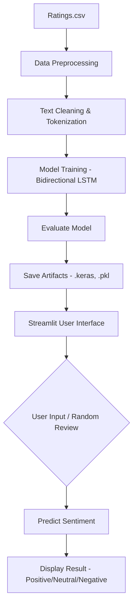

# 🍔 Zomato Review Sentiment Analysis

An advanced Sentiment Analysis system built with Deep Learning (Bidirectional LSTM) to classify Zomato restaurant reviews into **Positive**, **Neutral**, and **Negative** categories. The project includes a full training pipeline and a real-time Streamlit web interface.

## 🚀 Key Features
- **Deep Learning Core**: Utilizes a Bidirectional Long Short-Term Memory (LSTM) network for capturing context in restaurant reviews.
- **Interactive UI**: A Streamlit-based web application for real-time sentiment prediction.
- **Random Sampling**: Test the model instantly using a "Random" button that pulls real reviews from the dataset.
- **Robust Text Cleaning**: Specialized preprocessing to handle URLs, special characters, and noise in social media text.
- **Metric Visualizations**: Automated generation of accuracy and loss curves during training.

## 📂 Project Structure
- `script_code.py`: The heart of the project. Contains the data loading, cleaning, model architecture definition, and training logic.
- `app.py`: Streamlit application providing the user interface for end-users.
- `sentiment_model.keras`: The trained TensorFlow/Keras model file.
- `tokenizer.pkl`: Saved Keras Tokenizer used for text-to-sequence transformation.
- `label_encoder.pkl`: Saved LabelEncoder for mapping numerical predictions back to sentiment labels.
- `verify_zomato.py`: A utility script for quick dataset inspection and sentiment mapping verification.
- `training_metrics.png`: Visual output of the model's training performance.
- `Ratings.csv`: Source dataset extracted from the original Zomato Bangalore reviews.

## 📊 Dataset Source
The dataset used in this project is based on the **Zomato Bangalore Restaurants** data from Kaggle.
- **Source Link**: [Kaggle - Zomato Complete EDA and LSTM Model](https://www.kaggle.com/code/shahules/zomato-complete-eda-and-lstm-model/notebook)
- **Description**: This dataset contains rich information about restaurant experiences in Bangalore, including textual reviews and numerical ratings. It serves as an excellent resource for sentiment analysis due to the diversity of feedback provided by users across thousands of food outlets. In this project, we utilize over 120,000 processed reviews to train the Bidirectional LSTM model.

## 🧠 Model Architecture
The system uses an advanced Sequential model:
1. **Embedding Layer**: Converts words into 128-dimensional dense vectors.
2. **Spatial Dropout 1D**: Prevents overfitting on sequence patterns.
3. **Bidirectional LSTM (64 units)**: Processes text in both directions to capture better context.
4. **Batch Normalization**: Stabilizes training and speeds up convergence.
5. **Bidirectional LSTM (32 units)**: Further extracts deep features.
6. **Dense & Dropout Layers**: High dropout (0.5) ensures model robustness.
7. **Softmax Output**: Predicts probabilities for 3 classes (Positive, Neutral, Negative).

## 🛠️ Installation & Setup

1. **Clone the repository**:
   ```bash
   cd "Zomato LSTM Sentiment analysis"
   ```

2. **Install Dependencies**:
   ```bash
   pip install pandas numpy scikit-learn tensorflow matplotlib seaborn streamlit
   ```

3. **Train the Model**:
   (Ensure `Ratings.csv` is in the directory)
   ```bash
   python script_code.py
   ```

4. **Launch the App**:
   ```bash
   streamlit run app.py
   ```

## 📈 Performance & Metrics

The model demonstrates strong performance across all three sentiment classes. Below are the training and validation results visualized:


### Key Metrics:
- **Final Test Accuracy**: ~92% (as per latest training run)
- **Early Stopping**: Triggered to prevent overfitting, restoring the best weights.
- **Loss Optimization**: Sparse Categorical Crossentropy stabilized around 0.25 (Validation).

Detailed performance logs and the classification report (Precision, Recall, F1-Score for each class) are saved during the training pipeline execution in `script_code.py`.

## 📊 Workflow Diagram


## 📈 Performance
The model is trained with **Early Stopping** and **Learning Rate Reduction** on plateau, ensuring the best possible weights are saved without overfitting. Detailed performance logs and the classification report can be found in the terminal output after running `script_code.py`.
